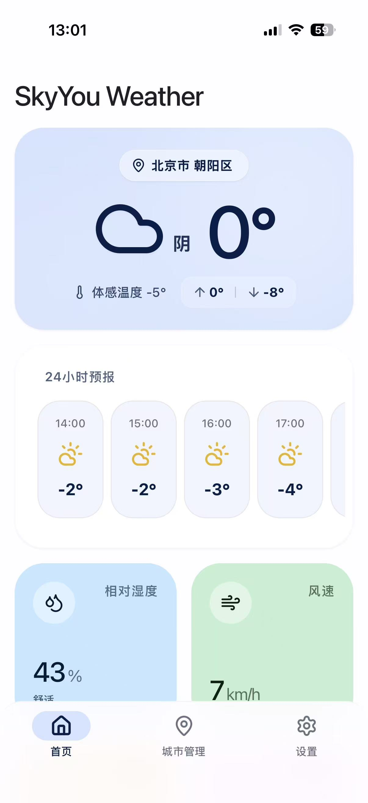
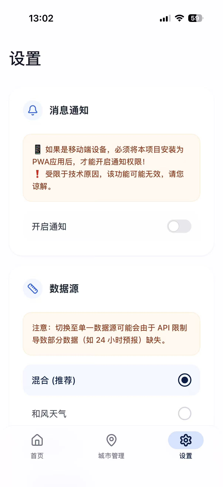
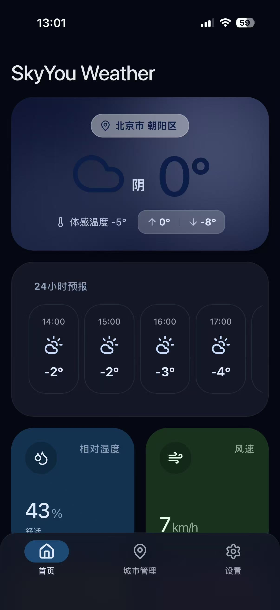
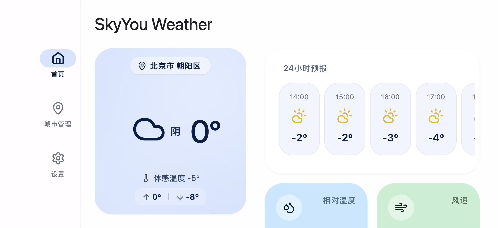
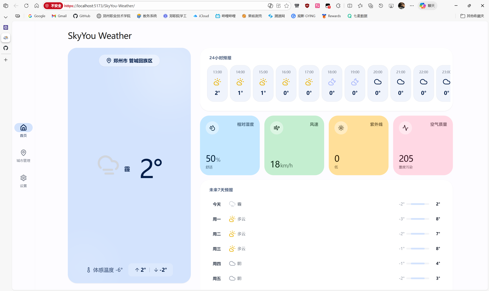

# SkyYou Weather

一个极致精美、移动端与桌面端兼备的渐进式 Web 应用 (PWA) 天气追踪器，深度采用 **Material You** 设计语言与响应式布局。

---

<p align="center">
  
</p>

## ✨ 核心特性 (Core Features)

*   **🚀 三合一气象引擎**：
    *   **和风天气 (QWeather)**：首选源，支持完整的 24 小时逐小时预报及实时空气质量 (AQI)。
    *   **彩云天气 (Caiyun)**：国内精准分钟级降水预报。
    *   **OpenWeatherMap**：全球高覆盖备用源。
*   **⚙️ 灵活数据分发器**：内置智能调度逻辑，支持**手动切换数据源**。混合模式（和风 > 彩云 > OpenWeather）确保数据永不断线。
*   **📱 顶尖移动体验**：
    *   基于 Material You 的色块化 UI，适配 **iOS 灵动岛/刘海屏**。
    *   **横屏深度优化**：独立侧边栏导航，面板状态锁定，杜绝手势回弹。
    *   **PWA 沉浸模式**：支持一键安装至主屏幕，享受原生 App 般的全屏体验与系统级通知。
*   **💻 桌面操作革命**：
    *   针对鼠标用户优化的**滚轮横向映射**。在“24小时预报”区域滚动滚轮可直接左右滑动。
    *   **严格操作隔离**：锁定横向滑动时的纵向溢出，交互手感更纯净。
*   **🔍 智能城市管理**：
    *   集成 OSM 地理逆编码，实时定位当前位置。
    *   支持多城市搜索与持久化保存，随开随看。
*   **🌓 个性化定制**：
    *   **主题引擎**：支持深色/浅色/系统同步，采用高质感毛玻璃效果。
    *   **通知系统**：支持早晚天气播报提醒功能。

---

##  界面预览 (Screenshots)

### 📱 移动端 (iOS)
<p align="center">
  
  
  
</p>

### 🌙 深色模式 & 横屏适配 (Dark Mode & Landscape)
<p align="center">
  
  
</p>

### 💻 桌面端 (Desktop)
<p align="center">
  
</p>

---

## 🛠️ 技术栈 (Tech Stack)

*   **框架**: React 19 + TypeScript 5
*   **构建**: Vite 6
*   **样式**: Tailwind CSS (现代响应式框架)
*   **图标**: Lucide React
*   **协议**: PWA (Service Workers + Web App Manifest)

---

## 🚀 快速启动 (Quick Start)

### 1. 环境准备
确保您的设备已安装 Node.js 环境。

### 2. 获取代码并安装
```bash
git clone https://github.com/EchoRan6319/SkyYou-Weather.git
cd SkyYou-Weather
npm install
```

### 3. 本地开发
```bash
npm run dev
```

#### ⚠️ 开发者性能提示
由于使用了 Web API (Geolocation, Notification)，本项目必须在 **安全上下文 (HTTPS)** 下运行。开发服务器已通过 Vite 配置了基本的 HTTPS 支持。

---

## ⚙️ 关键配置 (Configuration)

为了获得最佳体验，请 in `constants.ts` 中配置及您的私有 API Key：

```typescript
// d:\EchoRan\Documents\GitHub\SkyYou-Weather\constants.ts

export const QWEATHER_API_KEY = "您的和风天气Key";
export const QWEATHER_API_HOST = "api.qweather.com"; // 或 devapi.qweather.com
export const CAIYUN_API_KEY = "您的彩云Token";
export const OPENWEATHER_API_KEY = "您的OpenWeatherKey";
```

---

## 📜 更新记录 (Changelog)

### V3.2.0 RC (Current)
*   **性能飞跃 (Performance)**：迁移至 **Tailwind CSS v4** 原生构建插件，移除 CDN 运行时，大幅缩短首屏渲染时间（LCP）。
*   **架构重组 (Refactor)**：全面模块化 `App.tsx` 与天气服务引擎，引入 React 19 的组件化 Hook 模式。
*   **极致优化 (Bundle)**：启用 Gzip/Brotli 双压缩与代码分包（Manual Chunking），显著减少初始载入体积。
*   **视觉打磨**：通过 GPU 加速与渲染层优化，彻底解决高半径圆角的渲染锯齿（毛刺）问题。

### V3.1.1 RC
*   **交互补完**：实现 24 小时预报的鼠标滚轮映射与严格滚动隔离。
*   **视觉修正**：全平台隐藏多余滚动条，优化桌面端布局。

### V3.1.0 RC
*   **数据源自由**：新增手动切换数据源功能（混合/和风/彩云/OpenWeather）。
*   **机制固化**：移除 API 失败后的静默假数据回退，代之以真实的异常上报与诊断。

### V3.0.0 RC
*   **引擎重构**：正式接入和风天气，提供全量 24 小时逐小时预报。
*   **PWA 增强**：集成官方安装指南链接。

---

## 📄 License
基于 [MIT License](LICENSE) 开源发布。由 DeepMind Antigravity AI 协同构建。
